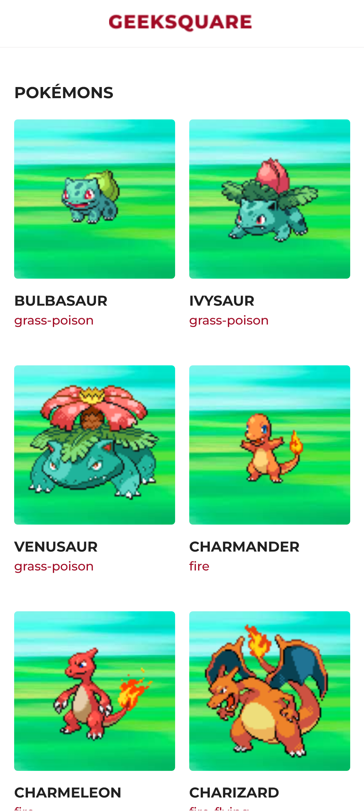
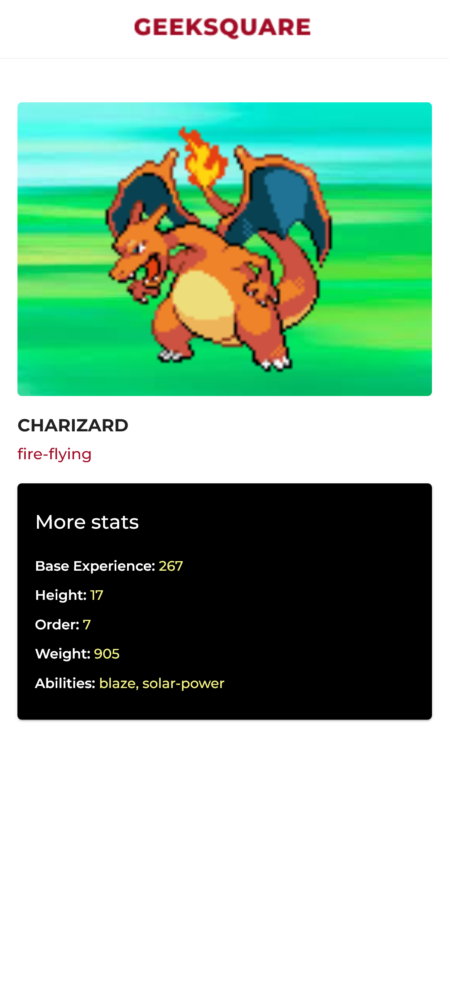
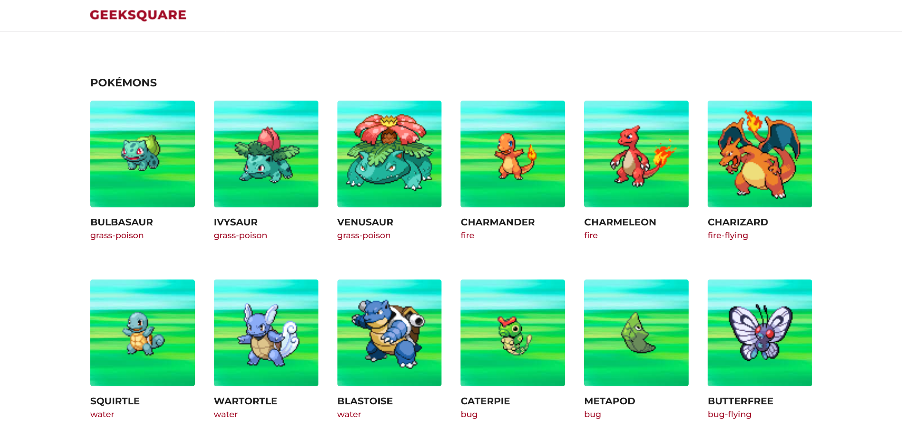
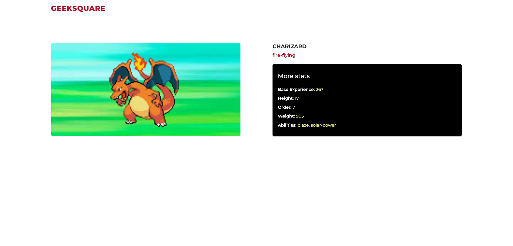

# React Pokedex

A webapp that lists Pokemon data using [pokenode-ts](https://pokenode-ts-docs-gabb-c.vercel.app/).

## Links

- Live site URL: [React Pokedex](https://miguelo0098-react-pokedex.netlify.app/)

## Screenshots

### Mobile

### Desktop

## Built With:

- [Create React App](https://github.com/facebook/create-react-app)
- [Material UI](https://mui.com)
- [pokenode-ts](https://pokenode-ts-docs-gabb-c.vercel.app/): a lightweight Node.js wrapper for the PokéAPI with built-in types.
- [React Router](https://reactrouter.com)
- [Netlify](https://netlify.com)
